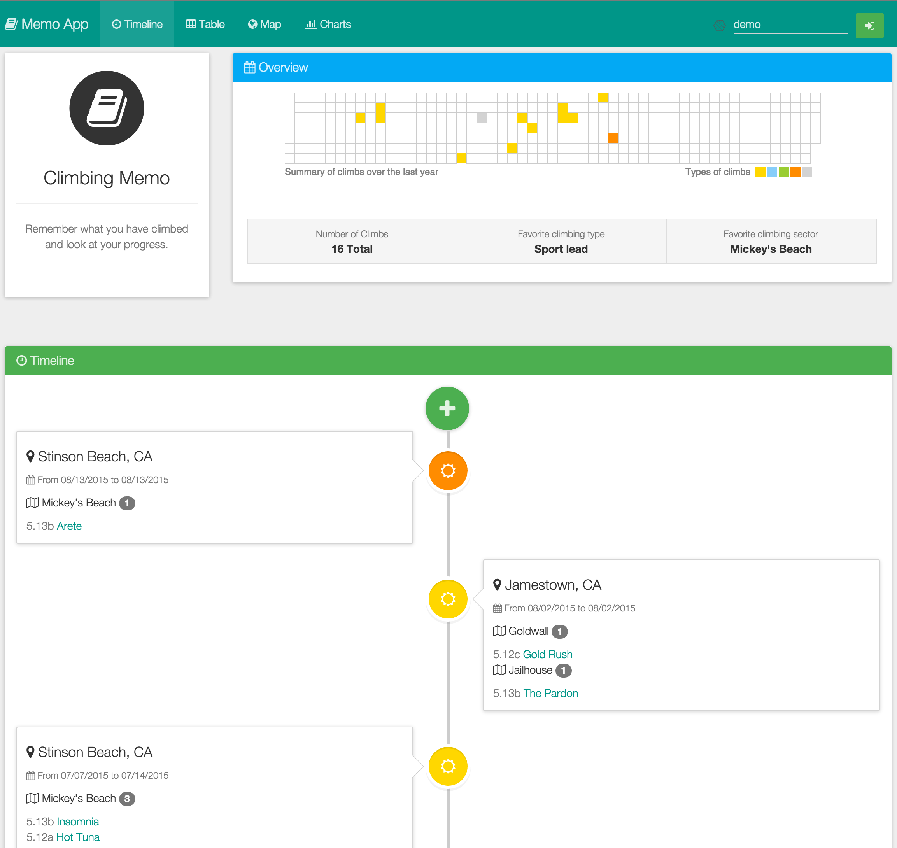

| | Travis | Coverralls | Heroku | Bithound |
|---|---|---|---|---|
| **Develop** | [](https://travis-ci.org/10alab/Siurana) | [](https://coveralls.io/github/10alab/Siurana?branch=develop) | [](https://test-climbing-memo.herokuapp.com) | [](https://www.bithound.io/github/10alab/Siurana) |
| **Master** | [](https://travis-ci.org/10alab/Siurana) | [](https://coveralls.io/github/10alab/Siurana?branch=master) | [](https://climbing-memo.herokuapp.com) | [](https://www.bithound.io/github/10alab/Siurana) |

[](https://www.codacy.com/app/cmizony/Siurana)
[](https://gitter.im/cmizony/10aLab)
[](https://saucelabs.com/u/cmizony)

[](https://saucelabs.com/u/cmizony)

# Climbing Memo

> Front-end application to visualize climbing data

**Features**
* Table and timeline of climbing routes
* Markdown support for routes notes
* Map of routes using Google Map API
* Charts generated with D3.js
* Offline mode
* Responsive design

Demo
-----

Hosted demo is available on heroku at [climbing-memo.herokuapp.com](http://climbing-memo.herokuapp.com/)

[](gallery)

Get started
-----

Make sure to have `npm`, `grunt` and `bower` installed.

Create a [firebase account](https://www.firebase.com/) and configure your database in [app.js](app/scripts/app.js#L30)


```sh
$ npm install && grunt serve
```

To run a production server use `npm start` and to run the unit tests use `grunt test`
Before contributing please read the [guidelines](https://github.com/10alab/Siurana/blob/develop/CONTRIBUTION.md)

To generate the documentation run `grunt jsdoc` and browse `dist/doc/index.html`

Technologies
-----

**Technologies:**

* Database:        Firebase
* Deployement:     Travis + Heroku
* Framework:       AngularJS
* Generator:       Yeoman-angular
* Style:           Sass + Bootstrap material design
* Tests:           Karma + Jasmine + Coveralls
* Validators:      Jshint + Jscs
* Visualizations:  D3 + Angular Gmap
* WebServer:       NodeJS & Grunt-http

Module structure
-----

**Angular module dependencies:**

```sh
             +---------+
    +------> |  Core   | <----+
    |        +---------+      |
    |                         |
+---+-----+              +----+-----+
|  Users  | <------------+  Routes  |
+---+-----+              +-+-----+--+
    ^                      ^     ^
    |                      |     |
    |        +-------------+     |
    |        |                   |
+---+--------+---+       +-------+---+
|  ClimbingMemo  +-----> |  Charts   |
+----------------+       +-----------+
```
